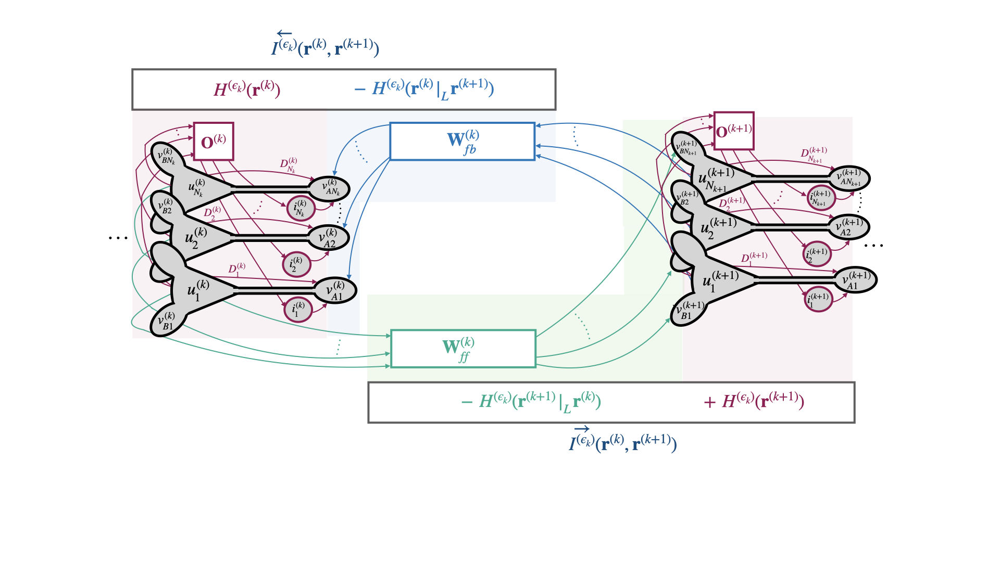

# Correlative Information Maximization: A Biologically Plausible Approach to Supervised Deep Neural Networks without Weight Symmetry

This repo contains the codes to reproduce the experiments presented in the paper "Correlative Information Maximization: A Biologically Plausible Approach to Supervised Deep Neural Networks without Weight Symmetry". 

TLDR: We propose correlative information maximization as a normative supervised learning principle that allows derivation of biologically-plausible networks of pyramidal neurons and resolves the weight symmetry problem. 

All the codes are written in Python 3.8 and utilizes Pytorch tensors to be able to run the codes in GPU.

## A segment of a CorInfoMax based neural network

 

# Python Version and Dependencies

* Python Version : Python 3.8.8

* pip version : 21.0.1

* Required Python Packages : Specified in requirements.txt file.

* Platform Info : OS: Linux (x86_64-pc-linux-gnu) CPU: Intel(R) Xeon(R) Gold 6248 CPU @ 2.50GHz

# Folder Contents

## src
Python Script         |  Explanation
:--------------------:|:-------------------------:
ContrastiveModels.py   | This python file includes our proposed framework Correlative Information-based neural network. ContrastiveCorInfoMaxHopfield and ContrastiveCorInfoMaxHopfieldSparse are the two methods that we proposed in our paper. Also, it includes other contrastive methods Equilibrium Propagation [1] and Contrastive Similarity Matching [2]. The implementation of EP is modified from the published code of [5].
ExplicitModels.py       | The explicit methods Predictive Coding [3] and Predictive Coding-Nudge [4] algorihtms are included in this python script.
torch_utils.py          | Some Pytorch utilization functions such as activation functions and evaluation functions.
visualization.py        | Some visuzalization helper functions.

## Notebook_Examples
Under this folder, you can find some jupyter notebook examples of our proposed framework in addition to examples of the algorithms that we used in the paper. For each framework, the folders are named accordingly, i.e., "CorInfoMax_Experiments" folder contains examples for our proposed method and "PCNudge_Experiments" contains examples for the algorithm in [4].

## Simulations

The image classification experiments are included inside the folder "Simulations/Classification". The subfolder for simulations are named accordingly, i.e., "Simulations/Classification/CorInfoMax" folder includes the simulations for our proposed method in the main text. Similarly, "Simulations/Classification/CorInfoMaxSparse" folder includes the simulations of our framework that is presented in Appendix E. 

The folder "Simulations/Classification/AnalyzeSimulations" contains the jupyter notebook files to generate the plots and tables presented in our paper. Below, we outline recipe to reproduce the experiments in our paper.

* For example, to simulate the experiments for MNIST classification task with CorInfoMax network, you need to run the python script "Simulations/Classification/CorInfoMax_MNIST_Simulation_V1.py". You can use the following command:

    ``` python Simulations/Classification/CorInfoMax_MNIST_Simulation_V1.py```

* Once you run this code, the following pickle files will be created under the folder "Simulations/Classification/Results":
    * Simulations/Classification/Results/simulation_results_CorInfoMax_MNIST_V1.pkl

* To analyze the results, you can use the code snippet from the jupyter notebook "Simulations/Classification/AnalyzeSimulations/Plot_CorInfoMax_MNIST_Results.ipynb". The section under the CorInfoMax title presents the table and plot for the results. This notebook also contains the comparison plots of our framework with other algorithms EP [1], CSM [2], PC [3], PC-Nudge [4]. In order to obtain these plots, you need to also run the simulation of other algorihtms, i.e., "Simulations/Classification/EP/EP_MNIST_Simulation.py" for EP results on MNIST dataset.

* As another example, to run the simulations on CIFAR10 dataset, run the following command:

    ``` python Simulations/Classification/CorInfoMax_CIFAR10_Simulation_V1.py```

It will generate the pickle file "Simulations/Classification/Results/simulation_results_CorInfoMax_CIFAR10_V1.pkl" containing the results. To analyze the results for this experiment, you can use the code snippet in the jupyter notebook "Simulations/Classification/AnalyzeSimulations/Plot_CorInfoMax_CIFAR10_Results.ipynb".

* Similar to the above two examples, you can run each experiment by running the corresponding python script in the "Simulation" folder. We suggest you to first look at the plots and tables in the jupyter notebooks located at the folder "Simulations/Classification/AnalyzeSimulations/".

* In particular, the notebook "Simulations/Classification/AnalyzeSimulations/Plot_CorInfoMax_Angle_Forward_Backward.ipynb" includes the plots for emprical angle between forward and backward weights. 

## References (for the other algorithms included in this code repo)

[1] Benjamin Scellier and Yoshua Bengio. Equilibrium propagation: Bridging the gap between energy-based models and backpropagation. Frontiers in Computational Neuroscience, 11, 2017.

[2] Shanshan Qin, Nayantara Mudur, and Cengiz Pehlevan. Contrastive similarity matching for supervised learning. Neural computation, 33(5):1300–1328, 2021.

[3] James CR Whittington and Rafal Bogacz. An approximation of the error backpropagation algorithm in a predictive coding network with local hebbian synaptic plasticity. Neural computation, 29(5):1229–1262, 2017.

[4] Beren Millidge, Yuhang Song, Tommaso Salvatori, Thomas Lukasiewicz, and Rafal Bogacz. Backpropagation at the infinitesimal inference limit of energy-based models: Unifying predictive coding, equilibrium propagation, and contrastive hebbian learning. In The Eleventh International Conference on Learning Representations, 2023.

[5] Axel Laborieux, Maxence Ernoult, Benjamin Scellier, Yoshua Bengio, Julie Grollier, and Damien Querlioz. Scaling equilibrium propagation to deep convnets by drastically reducing its gradient estimator bias. Frontiers in Neuroscience, 15:633674, 02 2021.